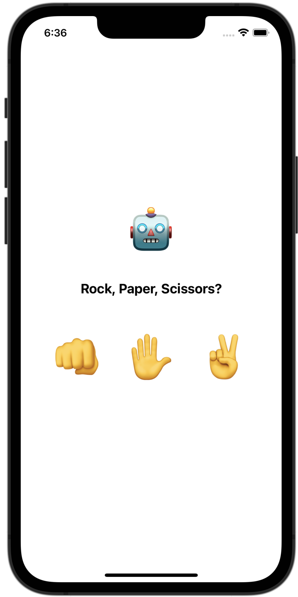

# Rock-Paper-Scissors
Rock, Paper, Scissors» game.

# Game rules:
- User vs an app itself.
- To play the game you’ll tap one of three signs: Rock (closed fist), Paper (open palm), or Scissors (two fingers, open like victory sign).
- Each sign can beat one (and only one) other: 
- [ ] Rock smashes scissors.
- [ ] Scissors cut paper.
- [ ] Paper covers rock.
- [ ] If user and an opponent choose the same sign, the game is draw. 

Based on Develop in Swift by Apple.

